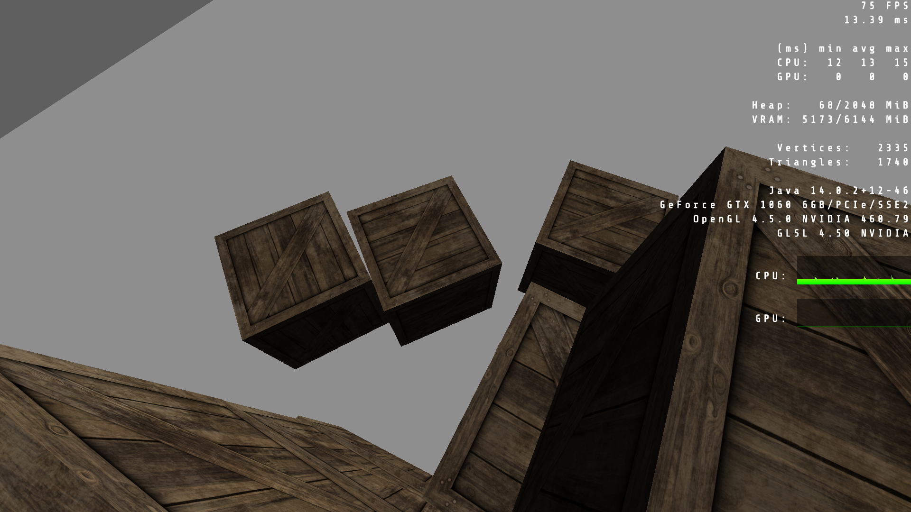
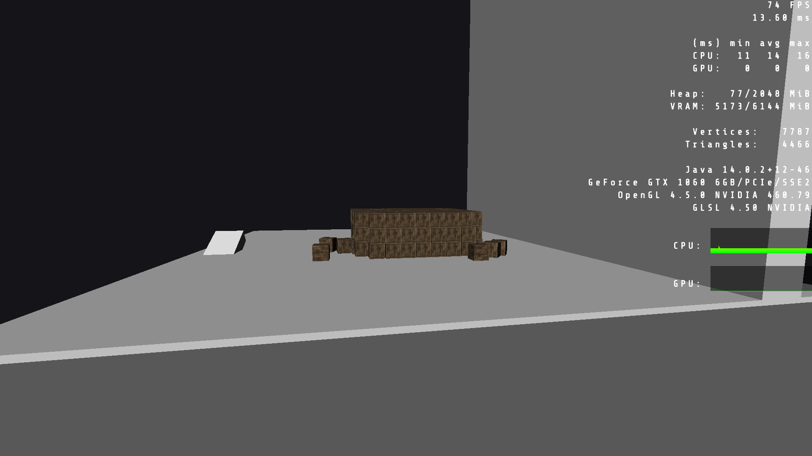
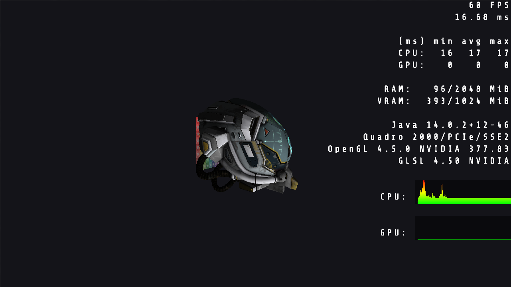

# Comet

🌠 Young attempt of a 16 y/o at writing a general purpose game engine using LWJGL.
The project will not likely build, and even if it manages to, most of the assets are missing.
Everything is sunk down in synchronization hell and ugly thread-server infrastructure, and yet somehow, it magically works without dead-locks due to hectoliters of tears and sweat.
I **DO NOT** advise anyone to build a game engine in this way, y'all should be better off using ECS with parallel execution of independent systems/jobs.

## Why This

I think some of the code here might turn out being useful for some trying to work with LWJGL and such.
And also, I simply want to archive something that I spent really quite a lot of time working on.

## Stuff That Works

- Hot-Swapping Graphics APIs is (in Theory) Possible Using This Quirky Design
- Runtime Resource Reload
- Vector Math Library and Basic Matrix Decomposition + Frustum Culling
- JBullet Physics Engine (If You Skip The Previously Mentioned Server Related Mess)
- Naive OpenAL Audio Engine (Also a Server...)
- Simple OpenGL 4.5 Renderer With Support for Layers, Graphs, Distance Field Fonts, GLTF Imports
- A Nice and Working Load Profiler Similar to The One Present in id Tech 6

## Screenshots

## License
You are free to do anything you want with this MIT-licensed abomination. See the **[LICENSE](LICENSE)** file for details.
